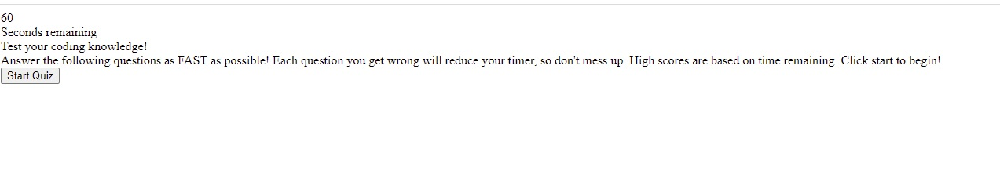

# code_quiz
Coding quiz using javascript!

---
## Author

Shawn Fox

| [GitHub](https://github.com/SFoxGit) | [Email](sfoxss4@gmail.com) |

---
## Project Links:

- Deployed site: [GitHub Pages]()
- GitHub: [SFoxGit]()

---
## Table of Contents

- [Description](##Description)

- [Requirements](##Requirements)

- [Progress](##Progress)

- [Contributions](##Contributing)

- [Credits](##Credits)

---
## Description

A timed coding quiz with multiple-choice questions. Browser based with dynamically updated HTML and CSS via JavaScript.

---
## Requirements

    GIVEN I am taking a code quiz
    WHEN I click the start button
    THEN a timer starts and I am presented with a question
    WHEN I answer a question
    THEN I am presented with another question
    WHEN I answer a question incorrectly
    THEN time is subtracted from the clock
    WHEN all questions are answered or the timer reaches 0
    THEN the game is over
    WHEN the game is over
    THEN I can save my initials and my score

---
### Must include:

    Storage of high scores

---
## Progress

Stage One:

*Understanding instructions*

    I must create an html, css, and javascript file. The quiz should be dynamically updating the html via javascript. I will need a second html for the high scores. Need to add a timer function on start. Need to add a function that removes time if answer is wrong. Create an end to the game on timer 0. Input for initials with recorded score.
    
Stage Two:

*html*

    For this project with maintaining the dynamic feel, the html is pretty bare bones and the javascript is doing all the heavy lifting. I'm going to try to keep pretty close to the example. 

Stage Three:

*Questions*

    I'll need a bank of questions, choices, and correct answers to draw from to populate the quiz. Created an array of arrays in javascript. 

Stage Four:

*Variables and Functions*

    Timer went easy enough, ended up putting the clear interval into the end of the game instead of the timer. I think I built the buttons in a bit of a weird way, did it differently and easier(thanks for the inspiration on that Max) for the ending. Questions I had to play around a bit with the order of the if statement but working great. I really like the end of game function, I think it ended up pretty neat. Doing the user input took a bit of time to figure out, and I think it can be cleaned up further. 

Stage Five:

*High scores*

    Needed to create a second HTML. Using the same javascript file ended up creating errors, cheated and just put divs associated to the buttons that were causing errors.

Stage Six:

*css*

    Running short on time for making this product look nice. Will update CSS as I can. Function over style in my opinion. 

---
## Contributing

Special thanks to Nicholas Marrone, we worked quite a few hours together on this project as we tossed ideas back and forth on how to complete the task. 

---
## Credits

W3 Schools for the question ideas
